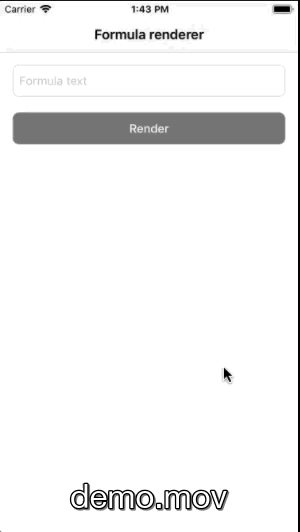

# Formula-Renderer-App

It allows the agonizing user to simply enter a formula into a text field and by pressing a button renders entered formula into a beautiful image



## Getting Started

### Prerequisites

- Xcode 10
- iOS12
- [Bundle 2.1.0](https://bundler.io/)
- [Fastlane 2.137.0](https://fastlane.tools/)

### Installing

#### Bundle
```
bundle install 
```

If Bundle command is not found
```
sudo gem install bundler
```

## Usage

Clone then run :rocket::rocket:

## Features

Sharing formula image and tex easily and smoothly using UIActivityViewController by share button

## Unit tests
Navigate to project directory then execute
```
bundle exec fastlane tests_lane
```

## Networking

Use native [Network Layer](https://github.com/marcinjackowski/NetworkLayer), thanks  [Marcin Jackowski](https://github.com/marcinjackowski) for such great work

## Design patterns

- VIPER
- Coordinator
- Delegation

## License

This project is licensed under the MIT License